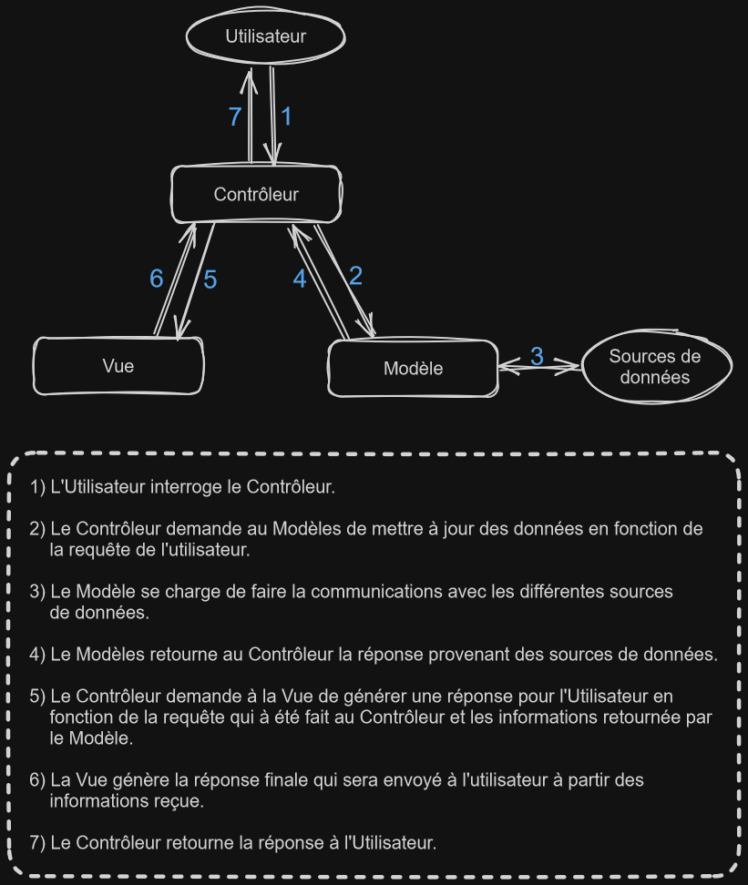
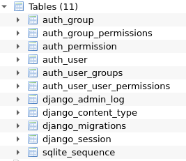
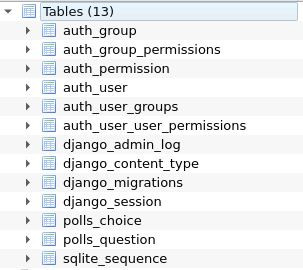
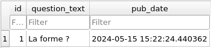
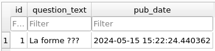
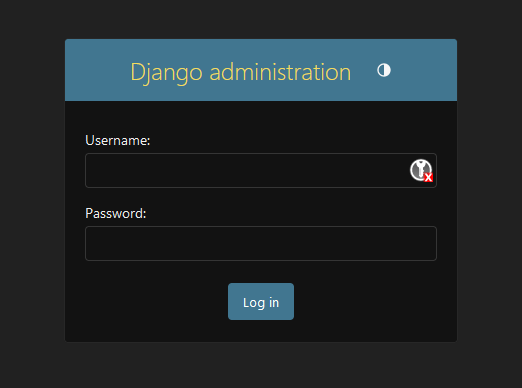

# Brainstorme

## Les bases

### Backend

Pour le backend nous avons trois possibilités :

1) Pas de backend
2) Un backend écrit en pure *Ruby*
3) Un backend fait avec *Django*

Si nous mettons en place un backend, nous n'avons pas le choix de la base de donnée, nous devons utiliser *PostgreSQL*.

### Frontend

Pour le frontend, nous avons deux possibilités :

1) Vanilla JS
2) *Bootstrap toolkit*

Dans tous les cas, notre application doit être une sigle page (SPA) et le navigation avec les bouton *Back* et *Forward* doit être fonctionnel.

L'application doit être compatible avec la dernière version stable de *Google Chrome*.

L'utilisateur ne doit jamais rencontré d'erreur nos gérer lors de la visite de l'application.

### Docker

Tout le projet doit pouvoir se construire et se lancer en une seule commande. Nous devons utiliser *Docker* comme solution de containerisation et nous pouvons par exemple utiliser la commande `docker-compose up --build`.

Si nous choisissons de faire tourner *Docker* sous Linux, nous devons l’utiliser *rootless* pour des raisons de sécurité. Nous avons le choix de rendre le projet dans une VM.

### Le jeu

La fonctionnalité première de l'application et de pouvoir jouer a *Pong* contre d'autre joueur.

Pour ce faire, le joueur doit pouvoir jouer une partie de Pong contre un autre joueur. Le deux joueur utilise le même clavier.

Un joueur doit pouvoir jouer contre un autre, mais il doit aussi pouvoir prendre part à un tournois. Un tournois consiste en plusieurs joueurs qui s'affronte les un contre les autres en plusieurs partie afin de déterminer le meilleur joueur. Nous avons le choix pour l'architecture et les règles des tournois.

Nous devons mettre en place un système pour enregistrer les participants à un tournois. Chaque participant doit choisir un pseudo. Le pseudo sera reset à la fin du tournois.

Nous devons implémenter un système de matchmaking. Le matchmaking gère le tournois, c'est lui qui planifie les matches et annonce le début des matches au joueurs.

Tous les joueurs sont soumis au mêmes règles, se qui inclus avoir la même vitesse de déplacement.

### Sécurité

Tous les mot de passes que nous stockons doivent être chiffré. Nous devons choisir un algorithme robuste.

Le site web doit être protégé contre les *injection SQL et XSS*.

Si nous utilisons un backend, nous devons activé *HTTPS* pour tous les aspects.

Nous devons validés toutes les inputs saisis par l'utilisateur par exemple, pour les formulaire.

Il est crucial de priorisé la sécurité de l'application. Que se soit pour la partie minimal comme pour les modules additionnels.

Tous les credientials doivent être stocker en local et en aucun cas sur Git.

## ToCheck

- [ ] Django
- [ ] PostgreSQL
- [ ] VanillaJS
- [ ] Bootstrap toolkit
- [ ] Hasing algorithme
- [ ] Docker rootless
- [ ] websocket
- [ ] HTTPS

## Django

- [Site officiel - Django](https://www.djangoproject.com/)
- [Documentation - Django](https://docs.djangoproject.com/en/5.0/)
- [Wikipédia - Django](https://fr.wikipedia.org/wiki/Django_(framework))

*Django* est un framework MVC composé de trois partie distinctes:

1) Un language de gabarit qui permet de générer du HTML ou tout autre format texte.
2) Un contrôleur qui fait du remapping d'URL sur la base d'expression régulière.
3) Une API d'accès aux données est automatiquement générée par le framework pour le CRUD (**C**reate, **R**ead, **U**pdate, **D**elete). Nous n'avons pas besoin d'écrire des requêtes SQL car elle sont gérées par l'ORM.

En plus de l'API d'accès aux données, une interface d'administration fonctionnelle est générée depuis le modèle de données. Un système de validation des données entrées par l'utilisateur est également disponible et permet d'afficher des messages d'erreurs automatiquement.

En plus des ces points, Django inclut aussi:

- Un serveur web pour le développement et les testes.
- Un système de traitement des formulaire muni de widgets permettant d'interagir entre du HTML et une base de données. De nombreuses possibilités de contrôles et de traitement sont fournies.
- Un framework de cache pouvant utiliser différente méthode (MemCache, système de fichier, base de données, ..).
- Le support de classes intermédiaires (middleware) qui peuvent être placées à des stades variés du traitement des requêtes pour intégrer des traitements particulier (cache, internationalisation, ...).
- La prise en charge complète d'Unicode.

### MVC

- [Wikipédia - MVC](https://fr.wikipedia.org/wiki/Mod%C3%A8le-vue-contr%C3%B4leur)

MVC (**M**odèle, **V**ue, **C**ontrôleur) est un design d'architecture logiciel. Il définit trois types de modules qui

#### Modèle

Le modules qui traite les *données ainsi que leurs logique*. C'est lui qui à la charge de faire la validation, la lecture et l'enregistrement sur les données. Le *modèle* ne fait pas que interroger la base de données, il les manipule. C'est par exemple lui qui va appliquer la logique métier et validé les inputs de l'utilisateur.

#### Vue

Le module qui met en forme les données traitée par le *modèle*. La *vue* retourne une réponse textuelle formatée au besoin : HTML, XML, JSON. Par exemple, si l'utilisateur demande la liste de toute les utilisateurs au *contrôleur users*. Le *contrôleur* va demander au modèle la liste de tous les utilisateur et envoyé cette liste à la *vue* qui va se charger d'en faire une page HTML avec une liste qui contient toutes les utilisateurs.

#### Contrôleur

Le modules qui traite les *actions de l'utilisateur* et qui coordonne le *modèle* et la *vue* afin de retourner une réponse complète à l'utilisateur. C'est le *contrôleur* qui va vérifié si l'utilisateur à le droit de faire une certaine action. Par exemple, le *controleur* vérifie que l'utilisateur qui à demander de supprimer l'utilisateur avec l'id 42 et bien un administrateur. Dans le cas contraire il retourne une erreur 403.

#### Représentation



#### Exemples

|Méthode|Endpoint|Description|
|-------|--------|-----------|
|GET|`http://localhost/users/`|Demander au contrôleur *users* d'afficher la liste de tous les utilisateurs.|
|GET|`http://localhost/users/<int:user_id>/`|Demande au contrôleur *users* d'afficher un utilisateur unique en fonction de *user_id*.|
|POST|`http://localhost/users/`|Demande au contrôleur *users* de créer un utilisateur avec les informations dans le corps de la requête POST.|
|PUT|`http://localhost/users/<int:user_id>`|Demande au contrôleur *users* de mettre à jour les informations de l'utilisateur correspondant à *user_id* avec les informations dans le body de la requête PUT.|
|DELETE|`http://localhost/users/<int:user_id>/`|Demande au contrôleur *users* de supprimer l'utilisateur à qui correspond *user_id*.|

### ORM

- [ORM - Wikipédia](https://fr.wikipedia.org/wiki/Mapping_objet-relationnel)

*ORM* (**O**bject-**R**elational **M**apping) est un type de programme informatique qui fait l'interface entre un programme et une base de donnée relationnelle pour simuler une base de données orientée objet. Ce programme créer des correspondances entre un schéma de base de donnée est une classe dans l'application.

L'*ORM* permet donc de connecté notre application Django à n'importe quel base de donnée relationnel facilement est rapidement. La définition de nos tables ainsi que ces champs en base de données sont créer en fonction de classe qui hérite de models.

```python
from django.db import models

class CustomUser(models.Model):
	first_name = models.CharField(max_length=30)
	last_name = models.CharField(max_length=30)

	def __str__(self):
		return f"{self.first_name} {self.last_name}"

```

Cette exemple définit une class *CustomUser* qui comporte un champ *first_name* ainsi qu'un champ *last_name*. Dans la base de donnée, l'*ORM* va créer une table nommé *customuser* avec deux champ *VARCHAR* de taille 30. Lorsque nous demandons à l'*ORM* de nous retourner les informations sur un utilisateur, il va nous retourner des instances de *CustomUser* peuplée avec les information reçue depuis la base de donnée.

Vu que l'*ORM* fait l'abstraction entre notre application et la base de données, il est très facile de faire une configuration de dev qui va interagir avec une base SQLite local et une configuration de prod qui va interroger la base de données Postgres de production.

### Installation

- [Doc - Django install](https://docs.djangoproject.com/en/5.0/intro/install/)

Afin de pouvoir installer *Django*, il faut absolument avoir Python d'installer ainsi que pip.

Si tous les prérequis sont installé, activez l'environnement virtuel est utiliser la commande suivante afin d'installer Django :

```bash
$> python -m pip install Django
```

Pour vérifié que l'installation de Django c'est bien déroulé, nous pouvons lancer l’interpréteur Python (`python`) et constater que nous avons la bonne version installé :

```python
>>> import django
>>> print(django.get_version())
5.0.6
```

Si vous voyez un numéro de version, c'est que l'installation est complète.

Vous pouvez aussi directement utiliser la commande suivante :

```text
$> python -m django --version

5.0.6
```

#### Python

vous devez absolument avoir python d'installer sur votre système afin de pouvoir utiliser Django.

[Ici](https://docs.djangoproject.com/en/5.0/faq/install/#faq-python-version-support) il y a la liste des version de python supporté par Django et ici la [page de téléchargement de Python](https://www.python.org/downloads/)

#### Pip

Si vous n'avez pas *pip* d'installer sur votre distribution, le plus facile est d'installer [standalone pip installer](https://pip.pypa.io/en/latest/installation/)

#### venv

- [Doc - Python venv](https://docs.python.org/3/tutorial/venv.html)

*venv* est un outil intégré a Python afin de créer des environnement virtuel isolé pour les projet Python. Il permet de gérer les dépendances de projets Python plus efficacement et plus proprement.

Grâce à *venv*, nous allons pouvons installer des modules Python dans l'environnement virtuel et il ne seront disponible nul par ailleurs. Nous n'allons donc pas polluer notre environnent principal ni l'environnent des autres projets.

Pour créer un environnement virtuel, il faut se rendre à la racine de notre projet et utiliser la commande `python3 -m venv <envname>`.

Si vous avez le message suivant, procéder à l'installation avec `apt install python<version>-venv`

```text
The virtual environment was not created successfully because ensurepip is not
available.  On Debian/Ubuntu systems, you need to install the python3-venv
package using the following command.

    apt install python3.10-venv

You may need to use sudo with that command.  After installing the python3-venv
package, recreate your virtual environment.

Failing command: /home/luca/Git/djangoTuto/djangoTuto/bin/python3
```

Si la création du nouvel environment virtuel c'est dérouler correctement, vous devriez voir un dossier portant le nom de l’environnement à la racine du projet.

Maintenant que nous avons créer notre environnement de travail virtuel, nous devons l'activé afin de pouvoir travail avec. L'activer signifie "se connecter à". Pour se faire, nous allons utiliser la commande `source <env_name>/bin/activate`. Maintenant, vous devriez voir votre prompte changer pour notifié que vous êtes bien à l'intérieur de l'environnement virtuel.

Pour quitter l'environnement, il suffit d'entré la commande `deactivate`.

Pour installer des modules dans l’environnement, il suffit de s'y connecter et d'installer le module normalement via pip.

### Création d'un projet

- [Tutoriel - Django](https://docs.djangoproject.com/en/5.0/intro/tutorial01/)

Maintenant que Django est installé, nous allons pouvoir créer un projet. Afin de découvrir Django et d'avoir une guide line, je vais suivre et détailler le tutoriel de la documentation officiel.

Nous allons donc pouvoir créer notre premier projet Django avec la commande suivante :

```text
$> django-admin startproject <project_name>
```

Cette commande va créer un dossier <project_name> qui contiendra la configuration initiale de notre projet Django. Pour ce tutoriel, je vais appeler mon projet Django de la même manière de que le repos Git, "djangoTuto".

```text
(djangoTuto-env) ➜  djangoTuto git:(main) ✗ ls
djangoTuto  djangoTuto-env
(djangoTuto-env) ➜  djangoTuto git:(main) ✗ tree djangoTuto
djangoTuto
├── djangoTuto
│   ├── __init__.py
│   ├── asgi.py
│   ├── settings.py
│   ├── urls.py
│   └── wsgi.py
└── manage.py

1 directory, 6 files
```

- Le dossier **djangoTuto/** est le répertoire root de notre application. Nous pouvons le renommer comme nous voulons, cela n'a aucune importance pour Django.
- Le fichier **manage.py** est un utilitaire en ligne de commande qui permet d'interagir avec notre projet Django. Plus d'informations [ici](https://docs.djangoproject.com/en/5.0/ref/django-admin/).
- Le dossier **djangoTuto/djangoTuto** est le dossier pour le module Python actuel de notre application. Sont nom est le nom du projet et ne doit pas être modifié.
- Le fichier **djangoTuto/__init__.py** est un fichier vide qui indique à Django que le répertoire doit être considéré comme un Package Python.
- Le fichier **djangoTuto/settings.py** contient les configurations de notre projet Django. Plus d'information [ici](https://docs.djangoproject.com/en/5.0/topics/settings/).
- Le fichier **djangoTuto/urls.py** contient les différents urls de notre projet ainsi que les actions qui leurs sont liée. Plus d'informations [ici](https://docs.djangoproject.com/en/5.0/topics/http/urls/).
- Le fichier **djangoTuto/asgi.py** est un point d'entrée pour que les serveur web compatible ASGI puissent servir le projet.
- Le fichier **djangoTuto/wsgi.py** est un point d'entrée pour que les serveur web compatible WSGI puissent servir le projet.


### Serveur de développement

Maintenant que nous avons vu comment se composait la configuration de base d'un projet Django, nous allons pouvoir vérifié qu'il fonctionne. Pour se faire, nous allons lancer le projet avec le serveur de développement intégrer :

```text
$> python manage.py runserver
```

```text
Watching for file changes with StatReloader
Performing system checks...

System check identified no issues (0 silenced).

You have 18 unapplied migration(s). Your project may not work properly until you apply the migrations for app(s): admin, auth, contenttypes, sessions.
Run 'python manage.py migrate' to apply them.
May 14, 2024 - 20:08:30
Django version 5.0.6, using settings 'djangoTuto.settings'
Starting development server at http://127.0.0.1:8000/
Quit the server with CONTROL-C.
```

> Pour le moment, nous pouvons ignorer les warnings à propos des migrations. Cela concerne la base de donnée que nous verrons plus loin dans le tutoriel

Nous venons de démarrer le projet sur le serveur de développement ! Se serveur est très pratique durant la création du projet mais il ne doit surtout pas être utilisé en production !

Maintenant que le serveur est en route, si vous vous rendez sur l'URL `http://127.0.0.1:8000` vous devriez voir une page avec un rocket qui vous informe que l'installation c'est bien déroulée.

Par défaut, *runserver* utilise le port 8000, il est possible de spécifié un autre port et même un autre host lors de l'appel du programme :

```text
$> python manage.py runserver 3000
```

```text
$> python manage.py runserver 0.0.0.0:4242
```

[Doc - Django runserver](https://docs.djangoproject.com/en/5.0/ref/django-admin/#django-admin-runserver)

### Création de l'app de sondage

Maintenant que l'environnement (le projet) est configuré, nous allons pouvoir nous mettre au travail.

Chaque application que nous écrivons pour Django consiste en un package Python qui suit certaine convention. Django est fourni avec un utilitaire qui génère automatiquement l'architecture de répertoire basique pour une app, afin de pouvoir se concentrer sur l'écriture du code plutôt que sur des taches ennuyeuses.

> La différence entre un projet et une app ? Une app est une application web qui fait quelque chose, par exemple: un blog, une base de donnée d'enregistrement public ou une petite app de sondage. Une projet et une collection de configurations et d'apps pour un site web particulier. Un projet peut contenir une multitude d'apps et une apps peut être dans une multitude de projet.

Votre apps peut vivre n'importe ou dans le Python path ([info](https://docs.python.org/3/tutorial/modules.html#tut-searchpath)). Dans ce tutoriel, nous allons créer notre app de sondage dans le même répertoire que *manage.py* comme cela, elle pourra être importée comme son propre module de haut niveau plutôt que comme un submodule de *djangoTuto*.

```text
$> python manage.py startapp polls
```

Cette commande à pour effet de créer un répertoire *polls* qui se comporte comme cela :

```text
(djangoTuto-env) ➜  djangoTuto git:(main) ✗ ls
db.sqlite3  djangoTuto  manage.py  polls
(djangoTuto-env) ➜  djangoTuto git:(main) ✗ tree polls
polls
├── __init__.py
├── admin.py
├── apps.py
├── migrations
│   └── __init__.py
├── models.py
├── tests.py
└── views.py

1 directory, 7 files
```

Cette structure de répertoire va contenir notre application de sondage.

### Écrire notre première vue

Nous allons écrire notre première vue. Pour se faire, nous allons travailler sur le fichier *polls/view.py* et ajouter le code suivant :

```python
from django.http import HttpResponse

def index(request):
	return HttpResponse("Index de /polls/")
```

C'est la vue la plus simple que nous pouvons faire. Pour pouvoir l'appeler, nous devons la mapper à un URL. Pour se faire, nous avons besoin d'un URLconf.

Pour créer un URLconf dans le répertoire polls, il faut créer un fichier qui se nomme *urls.py*. Le répertoire polls de maintenant ressemblé à ceci :

```text
polls
├── __init__.py
├── admin.py
├── apps.py
├── migrations
│   └── __init__.py
├── models.py
├── tests.py
├── urls.py
└── views.py
```

Dans le fichier *polls/urls.py* ajouter le code suivant :

```python
from django.urls import path

from . import views

urlpatterns = [
	path("", view.index, name="index"),
]
```

L'étape suivante est de faire pointer l'URLconf principal vers notre module *polls.urls*. Dans le fichier *djangoTuto/urls.py* ajouter un import vers *django.urls.include* et insérer un *include()* dans la liste *urlpatterns* pour avoir comme résultat :

```python
from django.contrib import admin
from django.urls import include, path

urlpatterns = [
	path('polls/', include("polls.urls")),
	path('admin/', admin.site.urls),
]
```

La fonction *include()* permet de référencer d'autre URLconf. Chaque fois que Django tombe sur un *include()*, il retire la partie de l'URL qui a matché le *path()* et envoyé se qui reste après dans l'URL à l'URLconf qui à été inclus.

> Chaque fois que nous devons inclure une urlpatterns il faut utiliser *include()*. La seul exception est *admin.site.urls*

Maintenant que nous avons câblé nos URLs, nous pouvons vérifié en relancent le serveur de test et en se rendant sur la page `http://localhost:8000/polls/`.

### Configurer la base de donnée

Nous allons continuer par aller jeter un oeil au fichier *djangoTuto/settings.py*. C'est un module Python qui contient les configurations de notre projet.

Par défaut, la configuration utilise *SQLite* comme base de donnée. Cela est pratique pour le développement car c'est une base de données relationnel qui est stockée dans un seul fichier en local. En plus de cela, *SQLite* est inclus dans Python, donc il n'y a rien de plus à installer afin de pouvoir utiliser la base de données. Par contre, dès la mise en production du projet, si nous avons besoin de changer de base de données pour quelque chose de plus scalable (par exemple: *Postgres*), nous pouvons le faire en changent simplement de configuration dans ce fichier *settings.py*.

Si nous voulons changer de base de données, nous devons installer le bon [database bindings](https://docs.djangoproject.com/en/5.0/topics/install/#database-installation) et changer la clé dans **DATABASE 'default'** pour matché avec la base de données que nous désirons :

- **ENGINE** - soit : `django.db.backends.sqlite3`, `django.db.backends.postgresql`, `django.db.backends.mysql`, `django.db.backends.oracle`. Vous trouverez [ici](https://docs.djangoproject.com/en/5.0/ref/databases/#third-party-notes) la liste des base de données supportée.
- **NAME** - Le nom de la base de données. Si nous avons sélectionner *SQLite*, la base de données est un chemin vers un fichier.

Si vous utilisez autre chose que *SQLite*, des paramètres supplémentaires peuvent être fournis, comme: *PASSWORD* et *HOST*. [Ici](https://docs.djangoproject.com/en/5.0/ref/settings/#std-setting-DATABASES), il y a la liste de toutes les configurations possibles.

Maintenant que nous sommes dans le fichier *settings.py*, nous pouvons profité pour set correctement *TIME_ZONE*.

Il faut aussi noté la présence de la configuration **INSTALLED_APPS** dans ce fichier. Cette configuration regroupe le nom de toutes les applications qui sont active dans notre projet Django. Les apps peuvent être utilisée dans une multitude de projets et nous pouvons les empaqueter et les distribuer afin qu'elles soient utilisées par d'autre projet.

Par défaut, **INSTALLED_APPS** contient les application suivantes:

- **django.contrib.admin** - Le site d'administration que nous verrons plus loin.
- **django.contrib.auth** - Un système d'authentification.
- **django.contrib.contenttypes** - Un framework pour les types de contenu.
- **django.contrib.sessions** - Un framework pour les sessions.
- **django.contrib.messages** - Un framework pour les messages.
- **django.contrib.staticfiles** - Un framework pour la gestion des fichiers statique.

Ces apps sont inclue par défaut pour ajouter du confort les cas commun.

Certaines de ces applicatrions on besoin d'au moins une table dans la base de données afin de pouvoir fonctionner. C'est pour cela que nous avons des warnings de migrations à chaque fois que nous lançons le serveur de dev. Nous allons corriger cela :

```text
$> python manage.py migrate
Operations to perform:
  Apply all migrations: admin, auth, contenttypes, sessions
Running migrations:
  Applying contenttypes.0001_initial... OK
  Applying auth.0001_initial... OK
  Applying admin.0001_initial... OK
  Applying admin.0002_logentry_remove_auto_add... OK
  Applying admin.0003_logentry_add_action_flag_choices... OK
  Applying contenttypes.0002_remove_content_type_name... OK
  Applying auth.0002_alter_permission_name_max_length... OK
  Applying auth.0003_alter_user_email_max_length... OK
  Applying auth.0004_alter_user_username_opts... OK
  Applying auth.0005_alter_user_last_login_null... OK
  Applying auth.0006_require_contenttypes_0002... OK
  Applying auth.0007_alter_validators_add_error_messages... OK
  Applying auth.0008_alter_user_username_max_length... OK
  Applying auth.0009_alter_user_last_name_max_length... OK
  Applying auth.0010_alter_group_name_max_length... OK
  Applying auth.0011_update_proxy_permissions... OK
  Applying auth.0012_alter_user_first_name_max_length... OK
  Applying sessions.0001_initial... OK
```

La commande **migrate** regarde la configration **INSTALLED_APPS** et crée toutes les tables en base de données qui ne serai pas présente et qui sont requise. Elle crée ces table grâce à la base de données configurée dans le fichier *tutoDjango/settings.py*.

> Afin d'afficher le contenu de la base de donnée *SQLite*, j'ai installé *sqlitebrowser*
>
> `$> apt instal sqlitebrowser`

Voici le contenu de notre base de données une fois que la migration a été éffectuée:



Nous pouvons donc constater que nous avons 11 table qui on été créer par Django.

```text
$> python manage.py runserver
Watching for file changes with StatReloader
Performing system checks...

System check identified no issues (0 silenced).
May 15, 2024 - 13:51:07
Django version 5.0.6, using settings 'djangoTuto.settings'
Starting development server at http://127.0.0.1:8000/
Quit the server with CONTROL-C.
```

Nous pouvons aussi constater que lors du lancement du server de developpement, nous n'avons plus de warning !

### Création de modèle

Maintenant que nous avons découvertcomment fonctionne la base de donnée et comment nous pouvons faire nos migration, nous allons pouvoir créer le modèle pour notre application de sondage.

Pour notre application, nous allons avoir besoin de créer deux modèles: *Question* et *Choice*. Une *Question* est composée d'une question et d'une date de publication. Un *Choice* est composer de deux champs: le texte du choix ainsi que le nombre de votes. Chaque *Choice* est assosié avec une *Question*.

Ces conceptes sont représenter par des classes Python. Editez le fichier *polls/models.py* pour qu'il ressemble a ceci:

```python
from django.db import models


class Question(models.Model):
	question_text = models.CharField(max_length=200)
	pub_date = models.DateTimeField("date published")

class Choice(models.Model):
	question = models.ForeignKey(Question, on_delete=models.CASCADE)
	choice_text = models.CharField(max_length=200)
	votes = models.IntegerField(default=0)
```

Ici, nous créeons deux classe qui hérite de la classe *django.db.models.Model*. Chaque modèle est composé d'attributs de classe, chaqun représente un champs de ce modèle.

Chaque champ est représenté par une instance de la classe *Field*, par exemple *CharField* pour un champ de charactère et *DateTimeField* pour un champs datetime. Ceci permet de dire à Django de quel type de donnée est chaque champ.

Le nom de chaque instance de *Field* (par exemple: *question_text* ou *pub_date*) et le nom du champ dans un format machine-friendly. Nous allons utiliser cette valeur dans notre code Python et la base de donnée va l'utiliser pour le nom du champ dans la base de donnée.

Certaines classes *Field* demande des arguments. Par exemple, *CharField*, demande le paramètre *max_length*. Cette information n'est pas utilisée seulement pour le champ en base de données mais aussi pour la validation.

Une classe *Field* peut aussi demander des paramètres optionels. Par exemple, nous avons définit le champ *votes* à 0 par défaut. Ceci était optionel.

Finallement, nous devons aussi noté que nous avons créer une relation en utilisant une *ForeignKey*. Ceci dit à Django que chaque *Choice* est en relation avec une seul *Question*. Django support toute les relations courantes des base de données relationnel: many-to-many, many-to-one et one-to-one.

### Activer un modèle

Maintenant que nous avons créer nos modèles, Django est capable de :

- Créer un schéma de base de donnée (*CREATE TABLE*) pour cette application.
- Créer un API d'accès à la base de donnée Python pour accéder à nos objets *Question* et *Choice*.

Mais pour commencer, nous devons dire à notre projet que notre application de sondage est installé.

Pour inclure notre app dans notre projet, ne devons ajouter une référence dans la configuration *INSTALLED_APPS* dans le fichier *djangoTuto/settings.py*. La classe *PollsConfig* est le fichier *polls/apps.py*, donc, son chemin est *polls.apps.PollsConfig*. Nous devons éditer le fichier *djangoTuto/settings.py* et ajouter le chemin vers notre app dans *INSTALLED_APPS*.

```python
INSTALLED_APPS = [
	'polls.apps.PollsConfig',
	'django.contrib.admin',
	'django.contrib.auth',
	'django.contrib.contenttypes',
	'django.contrib.sessions',
	'django.contrib.messages',
	'django.contrib.staticfiles',
]
```

Maintenant que Django sait comment inclure notre application de sondage dans notre projet, nous devons procéder à la migration pour ajouter nos nouveaux modèles à la base de données :

```
$> python manage.py makemigrations polls
Migrations for 'polls':
  polls/migrations/0001_initial.py
    - Create model Question
    - Create model Choice
```

La commande *makemigrations* permet de demande à Django de créer une nouvelle migration avec les nouvelles informations que nous avons mis dans nos modèles. A ce stade, Django n'a pas encore appliquer les changement dans la base de données, il a simplement créer le fichier qui permet d'appliquer ces modifications.

```
$> cat polls/migrations/0001_initial.py
# Generated by Django 5.0.6 on 2024-05-15 14:52

import django.db.models.deletion
from django.db import migrations, models


class Migration(migrations.Migration):

    initial = True

    dependencies = [
    ]

    operations = [
        migrations.CreateModel(
            name='Question',
            fields=[
                ('id', models.BigAutoField(auto_created=True, primary_key=True, serialize=False, verbose_name='ID')),
                ('question_text', models.CharField(max_length=200)),
                ('pub_date', models.DateTimeField(verbose_name='date published')),
            ],
        ),
        migrations.CreateModel(
            name='Choice',
            fields=[
                ('id', models.BigAutoField(auto_created=True, primary_key=True, serialize=False, verbose_name='ID')),
                ('choice_text', models.CharField(max_length=200)),
                ('votes', models.IntegerField(default=0)),
                ('question', models.ForeignKey(on_delete=django.db.models.deletion.CASCADE, to='polls.question')),
            ],
        ),
    ]
```

Ce fichier décrit la migration et peut être éditer avant d'être appliquer, mais il ne contient pas directement les requêtes SQL qui seront exécuté durant la migration. Pour voir le SQL qui sera exécuté, nous pouvons utiliser la commande *sqlmigrate*.

```text
$> python manage.py sqlmigrate polls 0001
BEGIN;
--
-- Create model Question
--
CREATE TABLE "polls_question" ("id" integer NOT NULL PRIMARY KEY AUTOINCREMENT, "question_text" varchar(200) NOT NULL, "pub_date" datetime NOT NULL);
--
-- Create model Choice
--
CREATE TABLE "polls_choice" ("id" integer NOT NULL PRIMARY KEY AUTOINCREMENT, "choice_text" varchar(200) NOT NULL, "votes" integer NOT NULL, "question_id" bigint NOT NULL REFERENCES "polls_question" ("id") DEFERRABLE INITIALLY DEFERRED);
CREATE INDEX "polls_choice_question_id_c5b4b260" ON "polls_choice" ("question_id");
COMMIT;
```

Le résultat de cette commande varie en fonction de la base de données qui est configurer dans le fichier *djangoTuto/settings.py*.

Si vous avez modifier votre migration à la main et que vous voulez vous assurez qu'elle est valide avant de l'appliquer, vous pouvez utiliser la commande *check*.

```text
$> python manage.py check
System check identified no issues (0 silenced).
```

Maitnenant que nous avons généré notre migration pour que notre base de données refléte les informations de nos nouveaux modèle, nous devons, comme tout à l'heure, utiliser la commande *migrate* afin d'appliquer notre nouvelle migration.

```text
$> python manage.py migrate
Operations to perform:
  Apply all migrations: admin, auth, contenttypes, polls, sessions
Running migrations:
  Applying polls.0001_initial... OK
```



La commande *migrate* prend toute les migrations en attente est les applique sur la base de données. Cela est pratique car nous pouvons créer nos propre migration afin de, par exemple, ajouter des données de test dans notre base de données de développement. Nous pouvons envoyer ces migration au d'autre développeur qui pourront les appliquer à leur environnement de développement.

### Jouer avec l'API

- [Doc - Django API](https://docs.djangoproject.com/en/5.0/topics/db/queries/)

Nous allons maintenant utiliser l'outil en ligne de commande que Django nous mette à disposition afin de jouer avec l'API que Django met en place pour nous.

```text
$> python manage.py shell
```

Nous utilisons cette commande plutôt que de simplement utiliser la commande `python` car *manage.py* set la variable d'environnement *DJANGO_SETTINGS_MODULE* donnt a Python le chemin pour importer le fichier *djangoTuto/settings.py*

Importer nos modèles:

```python
>>> from polls.models import Choice, Question
```

Afficher les question afin de constater qu'il n'y en a pas.

```python
>>> Question.objects.all()
<QuerySet []>
```

Créer une nouvelle *Question*:

```python
>>> from django.utils import timezone
>>> q = Question(question_text="La forme ?", pub_date=timezone.now())
```

Sauvegarder la nouvelle question dans la base de données:

```python
>>> q.save()
```



Maitenant que nous avons enregistrer notre questions dans la base de données, la question a un ID.

```python
>>> q.id
1
```

Nous pouvons accéder au champs du modèle via les attributs Python:

```text
>>> q.question_text
'La forme ?'
>>> q.pub_date
datetime.datetime(2024, 5, 15, 15, 22, 24, 440362, tzinfo=datetime.timezone.utc)
```

Nous pouvons modifier les attribut de notre question:

```python
>>> q.question_text = "La forme ???"
>>> q.save()
```



Nous pouvons afficher toutes les questions dans la base de donnée:

```text
>>> Question.objects.all()
<QuerySet [<Question: Question object (1)>]>
```

Nous avons ici un problème, quand nous affichons notre liste d'objet, nous voyons que notre objet se nomme *<Question: Question object (1)>* . Cette représentation n'aide vraiment pas la compréhention. Nous allons corriger ceci en éditant le modèle de notre application de sondage et en ajoiutante la méthode *__str__()* pour les *Question* ainsi que les *Choice*.

```python
from django.db import models

class Question(models.Model):
	question_text = models.CharField(max_length=200)
	pub_date = models.DateTimeField("date published")

	def __str__(self):
		return self.question_text

class Choice(models.Model):
	question = models.ForeignKey(Question, on_delete=models.CASCADE)
	choice_text = models.CharField(max_length=200)
	votes = models.IntegerField(default=0)

	def __str__(self):
		return self.choice_text
```

Il est important de définir *__str__()*, pas seulement pour rendre les choses plus lisible pour un humain mais aussi car cette information est utiliser par la page d'administration qui est automatiquement générée par Django.

Nous allons maintenant ajouter une méthode personalisé à note modèle:

```python
import datetime

from django.db import models
from django.utils import timezone

class Question(models.Model):
	question_text = models.CharField(max_length=200)
	pub_date = models.DateTimeField("date published")

	def __str__(self):
		return self.question_text

	# Nouvelle méthode
	def was_published_recently(self):
		return self.pub_date >= timezone.now() - datetime.timedelta(days=1)

class Choice(models.Model):
	question = models.ForeignKey(Question, on_delete=models.CASCADE)
	choice_text = models.CharField(max_length=200)
	votes = models.IntegerField(default=0)

	def __str__(self):
		return self.choice_text

```

Vous pouvez maintenant sauvegardez et relancer le shell:

```text
$> python manage.py shell
```
Afficher toute les *Question* en base de données:

```python
>>> Question.objects.all()
<QuerySet [<Question: La forme ???>]>
```

Nous pouvons constater que maintenant, lorsque nous affichons une *Question* c'est son *question_text* qui est affiché.

Nous pouvons aussi essayer notre nouvelle méthode:

```python
>>> from polls.models import Choice, Question
>>> q = Question.objects.get(pk=1)
>>> q.was_published_recently()
True
```

### Introduction à l'administration Django

Lorsque nous créons un modèle, Django crée pour nous des vue qui permet d'administrer ce modèle, cela nous fait gagner beaucoup de temps.

La première étape afin d'accéder à cette administration est de créer un administrateur:

```text
$> python manage.py createsuperuser
Username (leave blank to use 'luca'): admin
Email address: admin@mail.com
Password:
Password (again):
Superuser created successfully.
```

Maintenant que nous avons créer un superuser, nous pouvons relancer le server de test et nous rendre à l'adresse `http://localhost:8000/admin/`. Vous devriez arriver sur cette page



Vous pouvez vous connecter avec les informations que vous avez fourni lors de la création du superuser.

La nouvelle page est une interface qui a été générer automatiquement par Django. Pour le moment, nous ne pouvons gérer que les utilisateur est le groupe (cela est fournit par *django.contrib.auth*)

### Ajouter notre application à l'administration

Pour le moment, nous ne voyons pas notre app *polls* sur l'administration. Pour se fait, nous devons éditer le fichier *polls/admin.py* :

```python
from django.contrib import admin

from .models import Question

admin.site.register(Question)
```

Maintnant, vous devriez voir la gestion des *Question* dans l'administration.


### Ajoutons plus de vues

Nous allons maintenant ajouter plus de vue à notre appliquation de sondage. Ces vues seront un peu différentes car elle prennent des arguments.

```python
from django.http import HttpResponse

def index(request):
	return HttpResponse("Index de /polls/")

def detail(request, question_id):
	return HttpResponse("Question #%s" % question_id)

def results(request, question_id):
	return HttpResponse("Result of question #%s" % question_id)

def vote(request, question_id):
	return HttpResponse("Voting on question #%s" % question_id)

```

Nous devons maitenant définir des URLs afin de pouvoir joindre nos nouvelles vues.

```python
from django.urls import path

from . import views

urlpatterns = [
	path("", views.index, name="index"),
	path("<int:question_id>/", views.detail, name="detail"),
	path("<int:question_id>/results/", views.results, name="results"),
	path("<int:question_id>/vote/", views.vote, name="vote"),
]
```

Si vous lancez le sereur et que vous vous rendez sur les URLs que nous vennons de définir vous pourrez constater que nos nouvelles vues s'affiche correctement et qu'elle prennent bien en compte l'ID passé dans l'URL.

### Écrire des vues qui servent à quelque chose

Chaque vues sont résponsable de mettre en place au moins deux chose, retourner une *HttpResponse* avec le résultat de la page ou une erreur, comme par exemple *Http404*. A par ces deux point, vous pouvez rajouter se que vous voulez  à vos vues.

Notre vue peu lire des enregistrements depuis la base de données, ou pas. Elle peu utiliser un sysème de template comme celui qui est fourni par Django, ou un autre. Elle peu générer des PDF, générer de l'XML, créer une archive ZIP, tous se que nous voulons et en utilisant n'importe quelle bibliothèque Python que nous voulons.

La seul chose que Django veut, c'est une *HttpResponse* ou une exception.

Nous allons démontrer tout ceci en modifiant la vue index() que nous avons créer afin qu'elle affiche nos question.

```python
from django.http import HttpResponse

# Nous importons notre modèle directement dans la vue
from .models import Question

# Depuis notre vue, nous pouvons manipuler le modèle Question
def index(request):
	latest_question_list = Question.objects.order_by("-pub_date")[:5]
	output = ", ".join([q.question_text for q in latest_question_list])
	return HttpResponse(output)

def detail(request, question_id):
	return HttpResponse("Question #%s" % question_id)

def results(request, question_id):
	return HttpResponse("Result of question #%s" % question_id)

def vote(request, question_id):
	return HttpResponse("Voting on question #%s" % question_id)

```

Comme vous pouvez le constatez en appelant la vue *index()* depuis votre navigateur, nous affichons bien les *Question* que nous avons dans la base de données.

Nous avons quand même un problème, notre le rendu de notre vues est hardcodée dans le fichier Python, cela fait que chaque fois que nous voulons faire une modification graphique, nous devons modifié notre vue. Pour parer à ce problème, nous allons utiliser le moteur de template de Django afin de séparer le design et le code Python.

La première choses à faire est de créer un répertoire *templates* dans le répertoire *pools*. Django va regarder à cet endroit pour trouver des templates.

Dans le fichier *djangoTuto/settings.py*, la configuration *TEMPLATES* décrit comment Django doit rendre un template. Par défaut, l'option *APP_DIR* est set a true, se qui fait que Django va chercher dans toutes les applications listées dans *INSTALLED_APPS*.

Dans le dossier *templates* que nous vennons de créer, nous allons devoir créer un sous répertoire qui se nomme la même chose que notre app (*polls*) et dans ce répertoire, créer un fichier qui se nomme *index.html*.

Dans ce nouveau fichier, nous allons pouvoir mettre nos templates.

```html
<!DOCTYPE html>
<html lang="en">
<head>
	<meta charset="UTF-8">
	<meta name="viewport" content="width=device-width, initial-scale=1.0">
	<title>Index</title>
</head>
<body>

	<ulc
	
		<li><a href="/polls/{{ question.id }}/">{{ question.question_text }}</a></li>
	
	</ul>

	<p>No polls are available.</p>

</body>
</html>

```

Nous devons maintenant, mettre à jour notre vue afin qu'elle utilise notre template.


```python
from django.http import HttpResponse
from django.template import loader

from .models import Question

def index(request):
	latest_question_list = Question.objects.order_by("-pub_date")[:5]
	template = loader.get_template("polls/index.html")
	context = {
		"latest_question_list": latest_question_list,
	}
	return HttpResponse(template.render(context, request))

def detail(request, question_id):
	return HttpResponse("Question #%s" % question_id)

def results(request, question_id):
	return HttpResponse("Result of question #%s" % question_id)

def vote(request, question_id):
	return HttpResponse("Voting on question #%s" % question_id)
```

Ce code load le template qui s'appel *polls/index.html* et le passe au contexte. Le contexte est un dictionnaire qui map les noms de templates à des objets Python.

Si le template ainsi que la vue sont correcte, vous devriez voir les changement sur votre navigateur !

### Le raccourci render()

C'est une schéma que nous allons beaucoup reproduire, load un template, replir un contexte et retourner une *HttpResponse* avec comme résultat de rendre un template. Django fournit un raccourci. Voici notre vue *index()* ré-écrite avec cette méthode:

```python
from django.http import HttpResponse
from django.shortcuts import render

from .models import Question

def index(request):
	latest_question_list = Question.objects.order_by("-pub_date")[:5]
	context = {"latest_question_list": latest_question_list}
	return render(request, "polls/index.html", context)

def detail(request, question_id):
	return HttpResponse("Question #%s" % question_id)

def results(request, question_id):
	return HttpResponse("Result of question #%s" % question_id)

def vote(request, question_id):
	return HttpResponse("Voting on question #%s" % question_id)

```

La fonction *render()* prend comme première argument la *request*, le nom du *template* ainsi que le *context* (qui est optionel) et retourne une *HttpResponse*.

### Lever des erreurs 404

Nous allons nous attqué a la vue *detail()*, elle va nous permetre de voir comment nous pouvons gérer les exceptions dans nos applications.

```python
from django.http import HttpResponse, Http404
from django.shortcuts import render

from .models import Question

def index(request):
	latest_question_list = Question.objects.order_by("-pub_date")[:5]
	context = {"latest_question_list": latest_question_list}
	return render(request, "polls/index.html", context)

def detail(request, question_id):
	try:
		question = Question.objects.get(pk=question_id)
	except Question.DoesNotExist:
		raise Http404("Question does not exist")
	return render(request, "pools/detail.html", {"question": question})

def results(request, question_id):
	return HttpResponse("Result of question #%s" % question_id)

def vote(request, question_id):
	return HttpResponse("Voting on question #%s" % question_id)
```

Notre nouvelles vue *detail()* qui se charge d'afficher les informations sur un sondage en particulier retourne désormait une erreur 404 si le sondage demandé n'existe pas.

Nous devons maitentant créer le template *polls/detail.html*.

```html
<!DOCTYPE html>
<html lang="en">
<head>
	<meta charset="UTF-8">
	<meta name="viewport" content="width=device-width, initial-scale=1.0">
	<title>Detail</title>
</head>
<body>
	{{ question }}
</body>
</html>
```

Ce template est très simple, mais il fait le job. Nous pouvons constater que l'affichage n'a pas changer, mais maintenant, si nous demandons le détail sur un id de Question qui n'existe pas, nous avons une erreur 404 !
